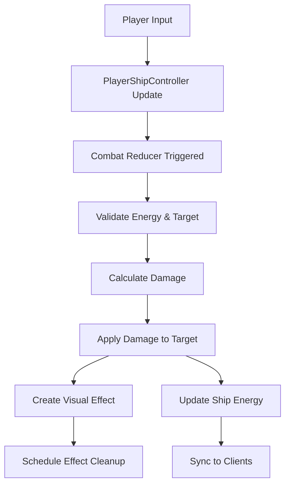

# Design Document

## Overview

The basic combat system implements real-time hitscan weapons for the Solarance: Beginnings MMO. The system leverages SpacetimeDB's reducer architecture to provide instant damage calculation, visual feedback through temporary database entries, and energy management integration. The design prioritizes computational efficiency by avoiding physics simulation for regular weapons while maintaining the foundation for future NPC combat and diverse weapon types.

## Architecture

### Core Components

The combat system consists of four main architectural components:

1. **Combat Reducers**: Server-side functions that process weapon firing, damage calculation, and target destruction
2. **Visual Effects System**: Temporary database entries that provide client-side combat feedback
3. **Energy Management Integration**: Weapon firing cost calculation and energy consumption
4. **Combat Mode Controller**: UI state management for combat vs utility modes

### Data Flow



## Components and Interfaces

### Database Tables

#### VisualEffect Table

```rust
#[dsl(plural_name = visual_effects)]
#[table(name = visual_effect, public)]
pub struct VisualEffect {
    #[primary_key]
    #[auto_inc]
    id: u64,

    pub source: Vec2,
    pub target: Vec2,

    pub effect_type: VisualEffectType,
    pub created_at: Timestamp,
}

#[derive(SpacetimeType, Debug, Clone, PartialEq, Eq)]
pub enum VisualEffectType {
    WeaponFire,
    MissileFire,
    Explosion,
}
```

#### VisualEffectTimer Table

```rust
#[dsl(plural_name = visual_effect_timers)]
#[spacetimedb::table(name = visual_effect_timer, scheduled(cleanup_visual_effect))]
pub struct VisualEffectTimer {
    #[primary_key]
    #[auto_inc]
    id: u64,

    #[use_wrapper(path = VisualEffectId)]
    pub effect_id: u64,

    pub scheduled_at: ScheduleAt,
}
```

#### NpcShipController Table (Placeholder)

```rust
#[dsl(plural_name = npc_ship_controllers)]
#[table(name = npc_ship_controller, public)]
pub struct NpcShipController {
    #[primary_key]
    #[auto_inc]
    id: u64,

    #[index(btree)]
    #[use_wrapper(path = StellarObjectId)]
    pub stellar_object_id: u64,

    // Combat actions (same as player)
    pub fire_weapons: bool,
    pub fire_missiles: bool,
    pub targetted_sobj_id: Option<u64>,

    // AI state
    pub ai_behavior: NpcBehavior,
}

#[derive(SpacetimeType, Debug, Clone, PartialEq, Eq)]
pub enum NpcBehavior {
    Idle,
    Patrol,
    Attack,
    Flee,
}
```

### Combat Reducers

#### process_weapon_fire

Should only be called by other reducers, therefore it should not itself be a reducer.

```rust
pub fn process_weapon_fire(
    ctx: &ReducerContext,
    source_sobj_id: u64,
    target_sobj_id: u64,
    actual_location: Vec2, // Where exactly did the projectile explode, used for AoE weapons.
    weapon_type: WeaponType,
    weapon_item_def: ItemDefinition // To get specific combat-related metadata
) -> Result<(), String>
```

Handles hitscan weapon firing with instant damage application. Produces a visual effect even
if the hit missed.

#### process_missile_fire

Should only be called by other reducers, therefore it should not itself be a reducer.

```rust
pub fn process_missile_fire(
    ctx: &ReducerContext,
    source_sobj_id: u64,
    target_sobj_id: u64,
    actual_location: Vec2, // Where exactly did the missile explode, used for AoE missiles.
    missile_type: MissileType,
    missile_item_def: ItemDefinition // To get specific combat-related metadata
) -> Result<(), String>
```

Placeholder for future missile system implementation.

#### cleanup_visual_effect

```rust
#[spacetimedb::reducer]
pub fn cleanup_visual_effect(
    ctx: &ReducerContext,
    effect_id: u64,
) -> Result<(), String>
```

Scheduled reducer to remove visual effects after their duration expires.

### Weapon System Integration

#### WeaponType Enum

```rust
#[derive(SpacetimeType, Debug, Clone, PartialEq, Eq)]
pub enum WeaponType {
    /// Most autocannons/blasters
    Hitscan,
    /// Slow/dodgable fire
    Projectile,
    /// e.g. Flak
    AreaOfEffect,
}
```

#### MissileType Enum

```rust
#[derive(SpacetimeType, Debug, Clone, PartialEq, Eq)]
pub enum MissileType {
    /// Set angle
    Dumbfire,
    /// Follows a stellar object
    Heatseeking,
}
```

#### Damage Calculation

The system uses existing ItemMetadata from weapon definitions:

- `BaseDamage`: Base damage multiplier
- `ShieldDamageMod`: Modifier against shields
- `KineticDamageMod`: Modifier against armor
- `EnergyConsumption`: Energy cost per shot
- `AreaOfEffect`: How big of an explosion does the weapon make based on where it hit.
- `FallOff`: How quickly does the damage fall off. e.g. missiles ~0.25, flak weapons ~0.75

### Client-Side Integration

#### Combat Mode State

```rust
#[derive(Debug, Clone)]
pub struct CombatState {
    pub combat_mode: bool,
    pub firing_effects: HashMap<u64, FiringEffect>,
}

pub struct FiringEffect {
    pub start_time: f64,
    pub duration: f64,
    pub source_pos: Vec2,
    pub target_pos: Vec2,
}
```

#### Input Handling Extensions

The existing `control_player_ship` function will be extended to handle:

- Q key for combat/utility mode toggle
- Spacebar for weapon firing (combat mode only)
- Left Control for missile firing (combat mode only)

## Data Models

### Existing Data Model Extensions

#### PlayerShipController

The existing `PlayerShipController` already contains the necessary fields:

- `fire_weapons: bool`
- `fire_missiles: bool` (note: currently `fire_missle` - will need correction)
- `targetted_sobj_id: Option<u64>`

#### ShipStatus

The existing `ShipStatus` contains health, shields, and energy fields that will be modified by combat:

- `health: f32`
- `shields: f32`
- `energy: f32`

#### Ship Equipment

The existing `ShipEquipmentSlot` system will be used to determine available weapons:

- Weapons in `EquipmentSlotType::Weapon` slots
- Item definitions provide damage and energy consumption values

### Damage Calculation Model

```rust
pub struct DamageCalculation {
    pub base_damage: f32,
    pub shield_damage: f32,
    pub hull_damage: f32,
    pub energy_cost: f32,
}

impl DamageCalculation {
    pub fn calculate(weapon_metadata: &[ItemMetadata], target_shields: f32) -> Self {
        // Extract weapon stats from metadata
        // Apply shield/kinetic modifiers
        // Calculate final damage values
    }
}
```

## Error Handling

### Combat Error Types

```rust
#[derive(Debug)]
pub enum CombatError {
    InsufficientEnergy,
    InvalidTarget,
    WeaponNotEquipped,
    OutOfRange,
    TargetDestroyed,
}
```

### Error Handling Strategy

- All combat reducers return `Result<(), String>`
- Client-side validation prevents most invalid requests
- Server-side validation ensures data integrity
- Graceful degradation for edge cases (target destroyed mid-flight)

### Logging and Debugging

- Use `spacetimedb::log::info!()` for combat events
- Log damage calculations for balancing
- Track energy consumption patterns
- Monitor visual effect cleanup performance

## Implementation Considerations

### SpacetimeDB Patterns

- Use `try_server_only(ctx)?` for server-only combat processing
- Implement proper foreign key relationships for data integrity
- Use scheduled reducers for timed cleanup operations
- Follow existing DSL wrapper patterns for type safety

### Performance Optimizations

- Batch visual effect cleanup operations
- Use indexed queries for target validation
- Minimize database writes during combat
- Optimize damage calculation algorithms

### Future Extensibility

- Generic weapon firing interface supports NPC integration
- Modular damage calculation supports new weapon types
- Visual effect system extensible for new effect types
- Combat mode system ready for additional utility modes

### Security Considerations

- Server-side validation of all combat actions
- Energy consumption enforcement
- Target validation prevents invalid attacks
- Rate limiting for rapid-fire prevention

This design provides a solid foundation for the basic combat system while maintaining compatibility with the existing SpacetimeDB architecture and preparing for future enhancements like NPC combat and diverse weapon types.
