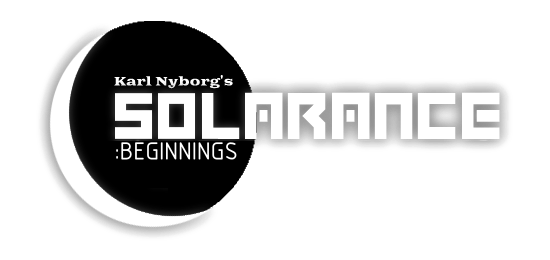
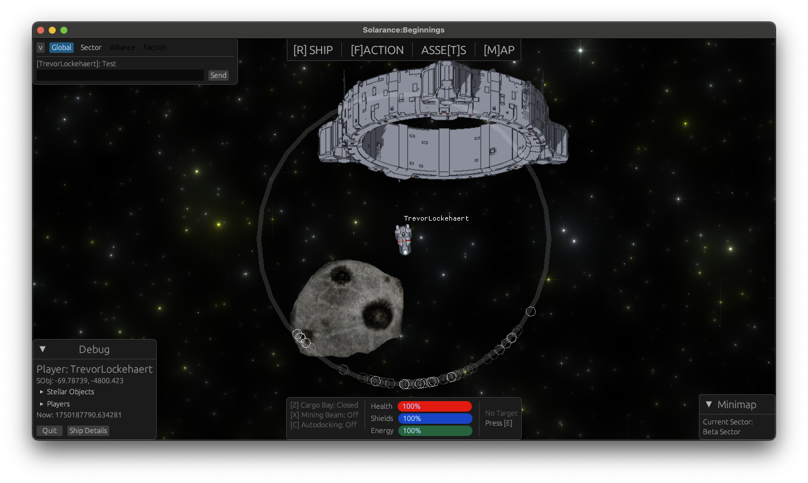

# Solarance: Beginnings

**A Top-Down 2D Living Universe Sci-Fi Space MMO**

[Discord](https://discord.gg/34xzCtsKxe) 🌌 [Bluesky](https://bsky.app/profile/galaxycr8r.bsky.social) 🌌 [Itch.io](https://galaxycr8r.itch.io/solarance-beginnings)

Solarance is a 2D top down game idea I've had for years now. Heavily inspired by
Escape Velocity: Nova, X2/X3, Freelancer, and numerous other entries in the space
adventure/building genre. This is a test project to explore Rust, Macroquad, and
[SpacetimeDB](https://spacetimedb.com/) to finally make the space MMO I've always wanted to make. You can help
either by contributing code - or just by playing this test client. Thank you for
joining me on this journey!

Goal is not to be a 2D EVE or Star Citizen, but a game where you can hopefully have fun
combat and creating stations with friends and exploring the unfolding universe.

For this initial stab, I'm focusing on real-time asteroids-like movement for combat.
However I expect this to be unsustainable in the long term, and in fact, not preferable
especially for keeping track of the MANY NPC entities that I want to be moving throughout
the universe all the time.

## Running the Game

For Macroquad you may have the download additional dependencies: https://github.com/not-fl3/macroquad#linux

Copy the `client/.env.template` file to `client/.env` and select the SpacetimeDB URL you want to use. The maincloud
instance might not always be available or up to date.

If you have Taskfile, Rust, etc. installed you should just be able to run `task client:run-full` in the root directory.

## Current State of the Project

The project has evolved significantly with the **0.2.0 release** marking a major milestone in playable features. The game now offers the beginnings of the core gameplay loop with exploration, mining, and travel mechanics.

### Version 0.2.0 Key Features

- **Complete Mining and Cargo System**

  - Functional asteroid mining with resource extraction
  - Cargo management with jettison capabilities
  - Multiple cargo crate types that can be picked up from space
  - Visual cargo bay interface showing capacity and contents
  - Resource types: Iron, Silicon, Space Fuel, and various ores

- **Jump Gate Travel System**

  - Inter-sector travel via jump gates
  - Auto-docking system for gate activation
  - Energy-based gate usage mechanics
  - Directional gate graphics (north/south/east/west orientations)
  - Seamless sector transitions

- **Enhanced Player Experience**

  - Account creation flow with username registration
  - Ship creation and spawn system
  - Improved ship movement with WASD/arrow key controls
  - Velocity-based physics with momentum
  - Target selection system for objects and asteroids

- **Comprehensive UI Overhaul**

  - Refactored GUI system with consistent widget architecture
  - Minimap showing current sector information
  - Galaxy map for sector navigation planning
  - Enhanced chat system (global and sector channels)
  - Ship details window with equipment and cargo tabs
  - Status widgets showing ship health, energy, and cargo
  - Debug interface with detailed ship and game state information

- **Technical Improvements**

  - Player identity system with proper ship ownership
  - Real-time multiplayer synchronization
  - Improved collision detection and physics
  - Better asset management and texture loading
  - Enhanced rendering system with proper sprite handling

- **macOS Compatibility Improvements**
  - Fixed asset loading paths for macOS app bundles
  - Improved cross-platform .env file handling
  - Better executable path detection for bundled applications

### Planned Core Features

- **Player-led Factions (PvP)**

  - Not just a group of players, Factions have numerous NPCs serving them
  - New players can choose to spawn as part of a faction if the faction allows it
  - Eventually I want Factions to be able to research new technologies that other factions don't have

- **Ship Building and Upgrades (PvE)**

  - Ship customization with different equipment types
  - Component-based ship damage system (planned)

- **Economy and Trading (PvE)**
  - Resource gathering from asteroids
  - Station-based trading system (planned)
  - Dynamic economy with supply and demand (planned)

### Contribution

The goals are set up fairly granularly in the form of [Issue Milestones](https://github.com/GalaxyCr8r/solarance-beginnings/milestones)

However almost NONE of the issues have descriptions. Please contact me on the SpacetimeDB discord or just comment on an issue that you'll like me to flesh out so it can be completed!

## License

All code is GPL 3.0

All art assets I withhold license to use. That may change when/if I get new artwork.
