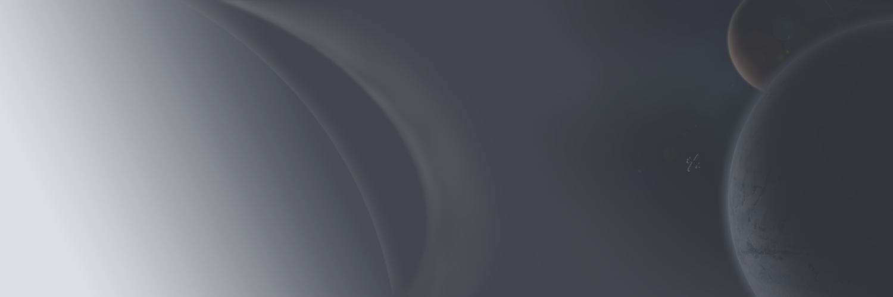

# Solarance: Beginnings

**A Top-Down 2D Living Universe Sci-Fi Space MMO**

Solarance is a 2D top down game idea I've had for years now. Heavily inspired by 
Escape Velocity: Nova, X2/X3, Freelancer, and numerous other entries in the space
adventure/building genre.

Goal is not to be a 2D EVE or Star Citizen, but a game where you can hopefully have fun
combat and creating stations with friends and exploring the unfolding universe.

For this initial stab, I'm focusing on real-time asteroids-like movement for combat.
However I expect this to be unsustainable in the long term, and in fact, not preferable
especially for keeping track of the MANY NPC entities that I want to be moving throughout
the universe all the time.

This is a test project to explore Rust, Macroquad, and SpacetimeDB to finally make the
space MMO I've always wanted to make.

## Running the Game

For Macroquad you may have the download additional dependencies: https://github.com/not-fl3/macroquad#linux

Copy the `client/.env.template` file to `client/.env` and select the SpacetimeDB URL you want to use. The maincloud
instance might not always be available or up to date.

If you have Taskfile, Rust, etc. installed you should just be able to run `task client:run-full` in the root directory.

## Current State of the Project

The project is actively evolving from an early prototype to a playable game. Recent development has focused on several key areas:

### Recently Implemented Features

- **Asteroid Fields and Mining System**
  - Dynamic asteroid generation with varying resource types
  - Ring-based asteroid cluster fields with configurable density
  - Multiple asteroid types with different resource compositions
  - Random asteroid sprite selection and rotation animations

- **Ship Controls and UI**
  - Improved ship movement and rotation controls
  - Ship details window with cargo and equipment management
  - Top menu bar with toggleable information panels
  - Enhanced debug interface with collapsible sections

- **Resource System**
  - Multiple resource types (Iron, Silicon, Space Fuel)
  - Resource collection mechanics (WIP)
  - Cargo management interface

### Planned Core Features

- **Player-led Factions (PvP)**
  - Not just a group of players, Factions have numerous NPCs serving them
  - New players can choose to spawn as part of a faction if the faction allows it
  - Eventually I want Factions to be able to research new technologies that other factions don't have

- **Ship Building and Upgrades (PvE)**
  - Ship customization with different equipment types
  - Component-based ship damage system (planned)

- **Economy and Trading (PvE)**
  - Resource gathering from asteroids
  - Station-based trading system (planned)
  - Dynamic economy with supply and demand (planned)

### Contribution

The goals are set up fairly granularly in the form of [Issue Milestones](https://github.com/GalaxyCr8r/solarance-beginnings/milestones)

However almost NONE of the issues have descriptions. Please contact me on the SpacetimeDB discord or just comment on an issue that you'll like me to flesh out so it can be completed!

## License

All code is GPL 3.0

All art assets I withhold license to use. That may change when/if I get new artwork.