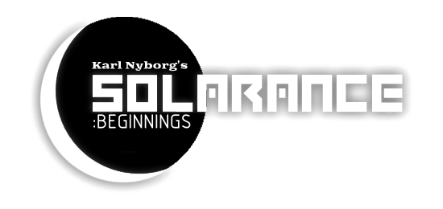
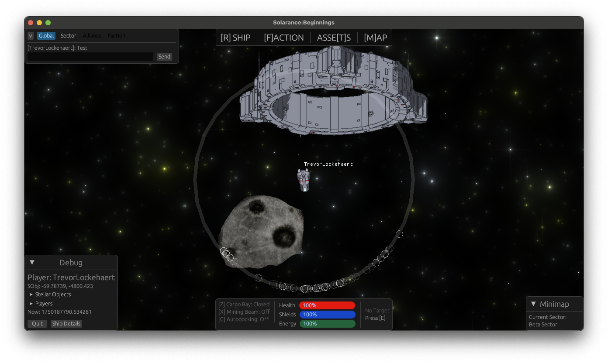

<div align="center">

# Solarance: Beginnings



**A cozy, persistent, co-op space sandbox for adults with jobs.**

[Discord](https://discord.gg/34xzCtsKxe) 🌌 [Bluesky](https://bsky.app/profile/galaxycr8r.bsky.social) 🌌 [Itch.io](https://galaxycr8r.itch.io/solarance-beginnings)



</div>

Solarance is built for the player EVE Online traumatized and lost — the one who loved building a presence in a quiet corner of space with friends, and quit the day a PvP gank erased a month of work. There is no mandatory combat here. No way to be set back by another player. Your progress waits for you whether you have 20 minutes or a Saturday afternoon, and when you come back it will still be there.

The core loop is **find → extract → haul → contribute → watch it grow.** Mine ore, haul it to a partially-built station, deposit it. Watch the station's progress bar tick up. See another player's ship dock while you're there. You both know what you're doing. Log off. Come back tomorrow.

The climactic beat is collaborative: *my pile got bigger, other people's piles got bigger, and together we made a thing.*

> **The project has shifted scope.** Earlier versions targeted a combat-and-exploration MMO. That vision is shelved. The MVP is now a cozy co-op builder with zero combat. See [`docs/Solarance_Beginnings_MVP_Design_Doc.md`](./docs/Solarance_Beginnings_MVP_Design_Doc.md) for the full design rationale and what "done" looks like.

---

## Running the Game

### Prerequisites

- **Rust** (latest stable) — [rustup.rs](https://rustup.rs/)
- **SpacetimeDB CLI** — `curl -sSf https://install.spacetimedb.com | bash`
- **Platform dependencies** for Macroquad graphics: [github.com/not-fl3/macroquad#linux](https://github.com/not-fl3/macroquad#linux)
- **Taskfile** (optional) — [taskfile.dev](https://taskfile.dev/)

### Quick Start

1. **Clone and configure:**

   ```bash
   git clone https://github.com/GalaxyCr8r/solarance-beginnings.git
   cd solarance-beginnings
   cp client/.env.template client/.env
   ```

2. **Set your SpacetimeDB instance** in `client/.env`:
   - `https://maincloud.spacetimedb.com` — public test instance (may lag behind `main`)
   - blank or `localhost` — run your own local server (recommended for development)

3. **Run:**

   With Taskfile:
   ```bash
   task start                  # start SpacetimeDB (separate terminal)
   task server:publish-clear   # build + publish server, clear DB
   task client:run-full        # generate bindings + run client
   ```

   Manually:
   ```bash
   spacetime start
   cd server && cargo build && spacetime publish solarance-spacetime-module && cd ..
   cd client && cargo run --release
   ```

### First Session

- Create an account and choose a username when prompted
- Use WASD or arrow keys to move; hotkeys are shown in parentheses throughout the UI
- Fly to an asteroid sector, mine ore, haul it back to the nearest construction site

---

## Current State

The movement and physics system is in place. Factions, basic station infrastructure, and the economy groundwork exist from earlier milestones but predate the scope change — some of that code will be simplified as the MVP takes shape.

**Next:** a two-player shared-building spike. Two ships, one partially-built station, real-time contribution updates for both players. No mining, no combat, no persistence yet. Just the core emotional beat, stripped bare.

For the full picture of what's planned, what's cut, and why: [`docs/Solarance_Beginnings_MVP_Design_Doc.md`](./docs/Solarance_Beginnings_MVP_Design_Doc.md).

---

## Contributing

Issues and milestones are tracked on [GitHub](https://github.com/GalaxyCr8r/solarance-beginnings/milestones). Most issues currently lack descriptions — comment on one you'd like fleshed out, or reach out on the SpacetimeDB Discord.

## License

All code is GPL 3.0. Art assets are withheld — that may change when new artwork arrives.
