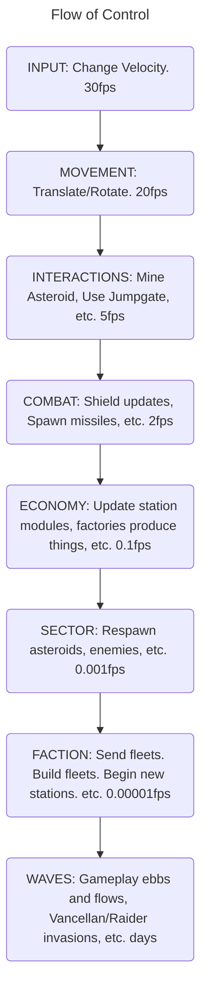
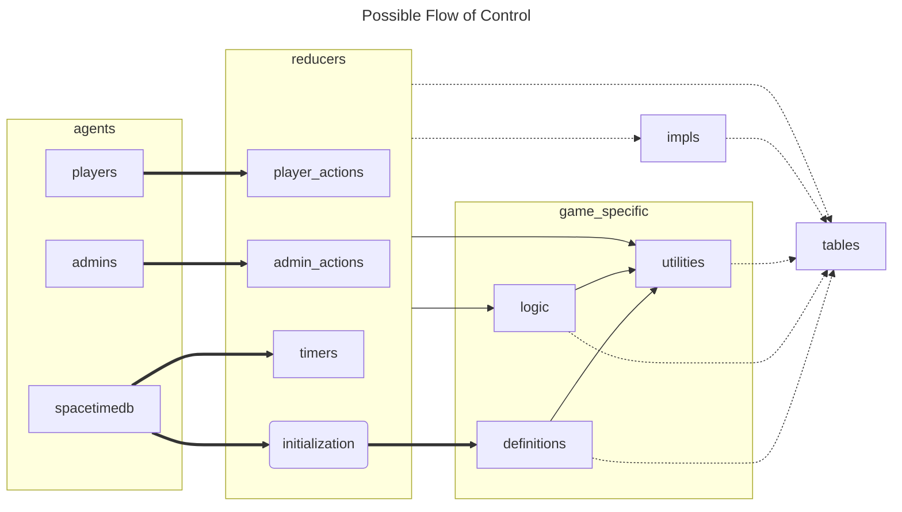

# Overview

Here be dragons.

## Core Loops

EVE Online learned 15~ years ago about the need for time dilation. It is important that
the systems of Solarance happen only after a measured amount of updates beneath it happen
so that if a prior reducer call takes longer than usual, it doesn't effect the GAME itself
but only the PERFORMANCE.

Below is an idealized view of what I see Solarance needing.

