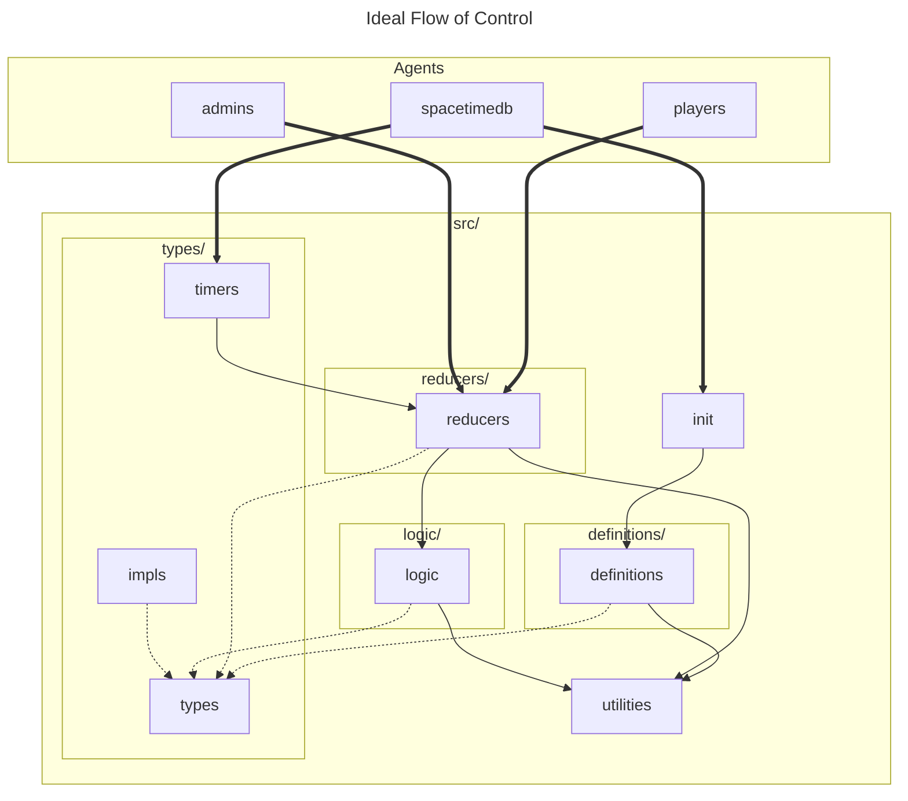

# Overview

Here be dragons.

```mermaid
---
title: Ideal Flow of Control
---
flowchart TD
%% Relationships
%% >Sources
    players==>reducers
    admins==>reducers
    spacetimedb==>timers
    spacetimedb==>init

%% >Internal
    init-->definitions

    definitions-.->types
    definitions-->utilities

    timers-->reducers

    reducers-->logic
    reducers-->utilities
    reducers-.->types

    logic-->utilities
    logic-.->types

    impls-.-> types

%% Topology
    subgraph "Agents"
        players
        admins
        spacetimedb
    end

    subgraph "src/"
        utilities
        definitions
        init

        subgraph "definitions/"
            definitions
        end

        subgraph "types/"
            types
            timers
            impls
        end

        subgraph "reducers/"
            reducers
        end

        subgraph "logic/"
            logic
        end
    end

```
